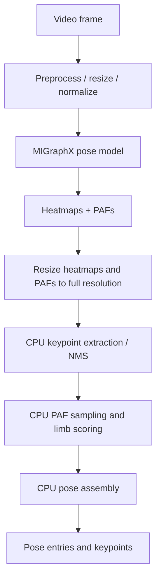
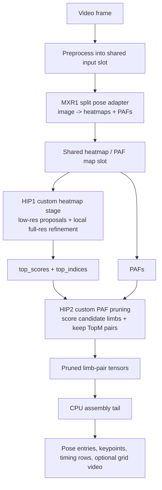

# AMD ROCm/MIGraphX Acceleration for Lightweight Human Pose Estimation

This repository is an AMD ROCm/MIGraphX optimization fork of the Lightweight OpenPose-style human pose estimation pipeline. It is intended for readers who open the repository for the first time and need to understand what was inherited from the earlier AMD port, what was added in this fork, how the code is organized, and how the main validation and stream-simulation entrypoints are run.

The important context is that the fork point was not the original PyTorch-only Lightweight Human Pose Estimation repository directly, but the AMD-oriented fork at `cane122/lightweight-human-pose-estimation.pytorch-AMD`. That fork had already moved the model toward AMD GPU execution through ROCm/MIGraphX. The work in this repository starts from that point and focuses on the next bottleneck: after neural-network inference became fast enough, the limiting factor moved into postprocessing, data movement, CPU/GPU scheduling, batching, and live multi-camera stream behavior.

The final recommended runtime path in this repository is the split pipeline:

```text
MXR1 + custom HIP heatmapping + custom HIP PAF-pruning
```

In code and command-line usage, that path is exposed primarily as:

```text
--variant split_hip2_host_smart
--split-paf-backend hip_host
```

The best confirmed 10-camera stream configuration uses a B2 split pose-adapter MXR model, a 2 ms batching timeout, two postprocess workers, shared-memory handoff, soft backpressure, and CPU pinning. Under that setup, the stream simulation processed 9,982 frames over 131.48 seconds, reaching 75.92 aggregate output FPS, 88.46 ms average end-to-end latency, and 109.42 ms P95 end-to-end latency. This result should be read as a live-monitoring stream result with latest-frame semantics, not as a claim that every source frame from 10 x 24 FPS cameras is fully emitted.

---

## Fork Lineage and Scope

This project has three layers of context:

| Layer | Role in this repository |
|---|---|
| Original Lightweight Human Pose Estimation / Lightweight OpenPose | Provides the MobileNet-based 2D multi-person pose model, heatmap and PAF output structure, and the original CPU postprocessing idea. |
| `cane122/lightweight-human-pose-estimation.pytorch-AMD` | Provides the AMD-oriented fork baseline, including the direction of running the pose model with ROCm/MIGraphX on AMD hardware. |
| `ognjen217/lightweight-human-pose-estimation.pytorch-AMD` | Adds postprocessing optimization, MIGraphX postprocess heads, split MXR/HIP execution paths, custom HIP kernels, validation tooling, profiling, and multi-camera stream simulation. |

The neural network concept remains the same: the model predicts body-keypoint heatmaps and part-affinity fields (PAFs), and the final human poses are assembled from those outputs. The main divergence is not a new pose model architecture, but a progressively optimized runtime around that model.

---

## Detailed Summary of Changes Since the Fork

The starting point for this work was an AMD/MIGraphX-enabled version of the lightweight pose model. Once the model could run through MIGraphX, inference itself was no longer the only interesting performance problem. Profiling showed that the classical postprocessing path still performed a large amount of CPU work: full-resolution heatmap resizing, keypoint extraction, non-maximum suppression, PAF sampling, limb scoring, pose assembly, and repeated CPU/GPU data movement. In other words, accelerating the neural network exposed the rest of the pipeline.

The first set of changes consolidated and optimized the CPU-side postprocessing baseline. The original postprocess flow was kept as `standard`, while faster variants such as `optimized_batch_k20_fast` introduced batched keypoint extraction and a faster grouping implementation. These variants were important because they created an accuracy-preserving CPU reference that was significantly faster than the original implementation. They also gave every later GPU/MIGraphX/HIP experiment a fair baseline to compare against.

The next step moved selected postprocessing stages toward GPU execution. The `gpu_nms_fullres_two_process` path runs MIGraphX inference and Torch GPU NMS in separate processes. That separation is deliberate: on some ROCm setups, initializing MIGraphX and PyTorch GPU execution in the same process is fragile or inefficient. The two-process design made it possible to test GPU heatmap NMS while keeping the model inference process stable. This phase showed that GPU postprocessing can help, but it also made clear that simply moving one operation to the GPU is not enough when later PAF scoring and pose assembly still dominate.

After that, the repository introduced MIGraphX postprocess heads. Instead of treating postprocessing as only Python/NumPy/OpenCV code, generated ONNX graphs were compiled into `.mxr` artifacts for fixed input shapes. The fused and fused-pruned paths moved manual cubic heatmap resizing, NMS, TopK extraction, PAF pair scoring, and pair pruning into compiled MIGraphX graphs. The `merged_fused_pruned` / `pose_postprocessing_merged` direction went further by merging the pose model and the fused-pruned postprocess head into one MXR graph. This was useful for high-resolution fixed-shape streams, but the dense full-resolution heatmap branch still created large intermediate tensors at 1080p.

The split pipeline was introduced to break that large fused graph into better optimization boundaries. In the `MXR1 + HIP1 + MXR2` design, MXR1 is a split pose-adapter model that produces only heatmaps and PAFs. HIP1 is a custom HIP smart heatmap candidate extraction stage that performs low-resolution proposal selection and local full-resolution refinement, returning compact `top_scores` and `top_indices`. MXR2 then consumes PAFs and the HIP1 TopK outputs to score and prune candidate limb pairs. This design made the stream simulator runnable with a clearer separation between model inference, heatmap candidate generation, and PAF pruning.

Profiling of the `MXR1 + HIP1 + MXR2` stream showed that MXR2 had become the next bottleneck. Full-resolution PAF sampling inside the MXR2 graph lowered into a large number of small MIGraphX gather kernels, so the final successful optimization replaced MXR2 with HIP2: a custom HIP backend for PAF pair scoring and pruning. The current recommended path is therefore `MXR1 + custom HIP heatmapping + custom HIP PAF-pruning`, or `split_hip2_host_smart` in the simulator. This path keeps the output contract of the split pipeline, but removes the gather-heavy MXR2 stage and improves the 10-camera stream from the previous MXR2-based best of 50.44 aggregate FPS and 194.60 ms average E2E latency to 75.92 aggregate FPS and 88.46 ms average E2E latency.

---

## Pipeline Evolution

### From fork baseline to the current split HIP2 runtime

```mermaid
flowchart LR
    A[Original Lightweight OpenPose idea<br/>MobileNet pose model + heatmaps + PAFs] --> B[cane122 AMD fork<br/>ROCm/MIGraphX model inference]
    B --> C[standard<br/>full-res resize + original keypoint extraction + original grouping]
    C --> D[optimized_batch_k20_fast<br/>batched K=20 extraction + faster CPU grouping]
    D --> E[gpu_nms_fullres_two_process<br/>MIGraphX inference process + Torch GPU-NMS postprocess process]
    E --> F[fused / merged / pruned MXR<br/>compiled postprocess heads and merged pose+postprocess graphs]
    F --> G[MXR1 + HIP1 + MXR2<br/>split pose adapter + custom HIP heatmap + MIGraphX PAF pruning]
    G --> H[MXR1 + HIP1 + HIP2<br/>split pose adapter + custom HIP heatmap + custom HIP PAF pruning]
    H --> I[Recommended stream path<br/>split_hip2_host_smart]
    H -. experimental, rejected for final benchmark .-> J[HIP1+HIP2 fused backend<br/>longer GPU critical section, worse overlap]
```



### Earlier standard-style runtime



### Current recommended runtime



---

## Runtime Concepts

| Term | Meaning |
|---|---|
| `standard` | Reference postprocess path: full-resolution resize, original per-channel keypoint extraction, original grouping. Useful as correctness baseline, but slow. |
| `optimized_batch_k20_fast` | CPU-optimized full-resolution path with batched K=20 candidate extraction and faster grouping. Good CPU fallback/reference. |
| `gpu_nms_fullres_two_process` | Hybrid path with MIGraphX inference in one process and Torch GPU NMS in another process. Useful when PyTorch ROCm and MIGraphX should not share one process. |
| `merged_fused_pruned` / `pose_postprocessing_merged` | Merged pose + fused-pruned postprocess MXR path. Useful for fixed-shape high-resolution graph experiments. |
| `MXR1` | Split pose-adapter MIGraphX model. It takes the image tensor and returns compact heatmaps and PAFs. |
| `HIP1` | Custom HIP heatmap candidate extraction. It performs smart low-resolution proposal selection and local full-resolution refinement, returning `top_scores` and `top_indices`. |
| `MXR2` | Previous split PAF-pruning MIGraphX graph. It consumes PAFs and TopK heatmap candidates, then outputs pruned limb-pair tensors. It was later replaced because it became gather-kernel dominated. |
| `HIP2` | Custom HIP PAF pair scoring and pruning backend. It replaces MXR2 while preserving the same pruned-pair output contract. |
| CPU assembly tail | Final dynamic pose assembly step that consumes TopK keypoints and pruned limb-pair tensors. This is still on CPU. |

---

## Performance Summary

The table below is intentionally limited to the results that explain the main optimization story. Detailed experiment logs and broader tables live in `reports/`.

| Stage / configuration | Main observation | Representative result |
|---|---|---:|
| Smart-full-res fused-pruned merged MXR | Avoids dense full-resolution heatmap work everywhere; keeps full-resolution output contract. | 10-camera 1080p stream improved from 28.16 to 50.57 aggregate FPS. |
| Smart-full-res COCO subset validation | Smart candidate generation preserved AP on the evaluated dominant-resolution subset. | AP 0.4324 vs CPU reference AP 0.4321. |
| MXR1 + HIP1 + MXR2 | First production-like split stream path. Heatmap stage became manageable, but MXR2 PAF sampling dominated. | 50.44 aggregate FPS, 194.60 ms avg E2E. |
| MXR2 isolated PAF pruning -> HIP2 isolated PAF pruning | Replaced gather-heavy MIGraphX PAF pruning with custom HIP PAF scoring/pruning. | 40.92 ms -> 8.08 ms, about 5.06x faster. |
| MXR1 + HIP1 + HIP2, B2/t2/P2 | Current recommended stream configuration. | 75.92 aggregate FPS, 88.46 ms avg E2E, 109.42 ms P95 E2E. |

Best confirmed stream configuration:

```text
Variant:              split_hip2_host_smart
Model:                models/split_pose_adapter/pose_adapter_b2_1080x1920.mxr
Pipeline:             MXR1 + custom HIP heatmapping + custom HIP PAF-pruning
MXR1 batch size:      2
Batch timeout:        2 ms
Post workers:         2
Backpressure:         soft
Source load:          10 simulated cameras, 24 FPS source rate
Duration:             130 s
Processed frames:     9,982
Aggregate output FPS: 75.92
Average E2E latency:  88.46 ms
P95 E2E latency:      109.42 ms
Average postprocess:  14.53 ms
```

---

## Repository Layout

```text
.
|-- accuracy_validation.py              Root COCO AP/AR + timing validation wrapper
|-- accuracy_validation_core.py          Main accuracy validation implementation
|-- speed_validation.py                  Root video speed validation entrypoint
|-- simulate_camera_stream.py            Root multi-camera stream simulator entrypoint
|-- modules/                             Model helpers, postprocessing registry, MIGraphX/HIP wrappers
|-- simulation/                          Modular stream simulator, workers, queues, shared memory, patches
|-- cpp/                                 HIP/C++ kernels for heatmap TopK, PAF pruning, fused experiments
|-- tools/                               ONNX export, MXR compilation, HIP builds, comparison/profile tools
|-- benchmark/                           Standalone benchmark scripts and older benchmark outputs
|-- reports/                             Main technical reports and result summaries
|-- docs/                                Longer background notes and supporting documentation
|-- models/                              Expected location for ONNX/MXR/checkpoint artifacts
|-- outputs/                             Generated CSV/JSON/video outputs from local runs
+-- requirements/requirements.txt        Python dependency list used by this fork
```

The most important implementation files for understanding the current pipeline are:

| File | Why it matters |
|---|---|
| `modules/postprocessing.py` | Central registry of postprocess variants used by validation scripts. |
| `simulation/cli.py` | Base CLI parser for `simulate_camera_stream.py`. |
| `simulation/split_hip_smart_patch.py` | Adds `split_hip_host_smart` and `split_hip2_host_smart` stream behavior. |
| `simulation/split_hip_fused_patch.py` | Adds the experimental fused HIP backend option. |
| `modules/external_heatmap_topk.py` / `modules/external_heatmap_topk_hip.py` | Python wrappers around HIP1 heatmap TopK backends. |
| `modules/external_paf_prune.py` / `modules/external_paf_prune_hip.py` | Python wrappers around HIP2 PAF pruning backends. |
| `tools/export_split_pose_adapter.py` | Builds MXR1 split pose-adapter models. |
| `tools/export_split_paf_pruning_from_topk.py` | Builds the previous MXR2 PAF-pruning graph. |
| `tools/export_batchaware_fused_pruned_postprocess.py` | Exports fused-pruned postprocess ONNX heads. |
| `tools/compile_merged_pose_batchaware_fused_pruned.py` | Merges pose ONNX and fused-pruned postprocess ONNX into a single MXR. |

---

## Setup

Create and activate a Python environment:

```bash
python3 -m venv venv
source venv/bin/activate
pip install -r requirements/requirements.txt
```

Check that MIGraphX is importable:

```bash
python -c "import migraphx; print('MIGraphX OK')"
```

If MIGraphX is installed under `/opt/rocm` but Python cannot import it, add the ROCm library path to the active environment:

```bash
python - <<'PY'
import site
from pathlib import Path

site_dir = Path(site.getsitepackages()[0])
(site_dir / "rocm-migraphx.pth").write_text("/opt/rocm/lib\n")
print(site_dir / "rocm-migraphx.pth")
PY
```

Common geometry used by the current experiments:

```text
Model input:          [B, 3, 544, 968]
Low-resolution maps:  heatmaps [B, 18 or 19, 68, 121], PAFs [B, 38, 68, 121]
Stream resolution:    commonly 1920x1080 or 1280x720 CCTV-like videos
Stride:               8
```

Typical local artifacts expected by the example commands:

```text
models/checkpoint_iter_370000.pth
models/fp16_refinment1.onnx
models/split_pose_adapter/pose_adapter_b2_1080x1920.mxr
coco/val2017/
coco/annotations/person_keypoints_val2017.json
cctv_1280x720_24fps_1.mp4
cctv_1280x720_24fps_2.mp4
cctv_1280x720_24fps_3.mp4
cctv_1280x720_24fps_original.mp4
```

---

## Generating and Compiling Models

The repository contains several model-generation paths. The important distinction is:

| Artifact | Purpose |
|---|---|
| Pose ONNX | Exported from the PyTorch `.pth` checkpoint. |
| Pose MXR | Static-batch MIGraphX model for pose inference only. |
| Fused-pruned postprocess ONNX/MXR | Compiled postprocess head for fixed heatmap/PAF and output resolution shapes. |
| Merged pose+postprocess MXR | Single MXR graph containing pose inference plus fused-pruned postprocess outputs. |
| MXR1 split pose adapter | Current final stream model. Produces heatmaps and PAFs for HIP1/HIP2. |
| MXR2 split PAF-pruning graph | Previous split-path PAF pruning backend. Replaced by HIP2 in the final stream path, but still useful for comparison. |
| HIP1/HIP2 shared libraries | Native HIP postprocess backends loaded by Python wrappers. |

### 1. Export the PyTorch checkpoint to ONNX

`tools/export_dynamic_onnx.py` exports the PyTorch checkpoint into a dynamic-batch ONNX model. The script currently uses constants near the top of the file, so edit them if your checkpoint or output path differs.

```bash
python tools/export_dynamic_onnx.py
```

Default paths used by the script:

```text
Input checkpoint: models/checkpoint_iter_370000.pth
Output ONNX:      pose_model_dynamic.onnx
Input geometry:   [1, 3, 544, 968]
```

### 2. Compile static-batch pose MXR models

For normal pose-model MXRs, compile the exported pose ONNX with static batch sizes:

```bash
python tools/compile_migraphx_static_batches.py \
  --onnx pose_model_dynamic.onnx \
  --height 544 \
  --width 968 \
  --batches 1 2 4 \
  --out-dir models \
  --output-prefix pose_model
```

This produces files like:

```text
models/pose_model_b1_fp16.mxr
models/pose_model_b2_fp16.mxr
models/pose_model_b4_fp16.mxr
```

Use `--no-fp16` to compile without FP16 quantization, or `--exhaustive-tune` when you want MIGraphX exhaustive tuning and can afford the compile time.

### 3. Export a fused-pruned postprocess head

This creates an ONNX graph that consumes heatmaps and PAFs and returns compact TopK keypoint and pruned limb-pair tensors.

For the smart-full-res path used in high-resolution merged experiments:

```bash
mkdir -p models/fused_postprocess_pruned_batchaware

python tools/export_batchaware_fused_pruned_postprocess.py \
  --onnx models/fused_postprocess_pruned_batchaware/fused_pruned_b4_1080x1920_smart.onnx \
  --batch-size 4 \
  --in-h 68 \
  --in-w 121 \
  --full-h 1080 \
  --full-w 1920 \
  --topk 20 \
  --limb-topm 20 \
  --threshold 0.1 \
  --nms-radius 6 \
  --nms-impl separable \
  --heatmap-mode smart-full-res \
  --smart-proposals 64 \
  --smart-local-radius 8 \
  --smart-lowres-nms-radius 1
```

Compile an arbitrary generated ONNX to MXR with:

```bash
python tools/compile_onnx_to_migraphx.py \
  --onnx models/fused_postprocess_pruned_batchaware/fused_pruned_b4_1080x1920_smart.onnx \
  --out models/fused_postprocess_pruned_batchaware/fused_pruned_b4_1080x1920_smart.mxr
```

### 4. Build a merged pose + fused-pruned MXR

The merged path combines the pose model ONNX and the fused-pruned postprocess ONNX into one compiled MXR graph.

```bash
python tools/compile_merged_pose_batchaware_fused_pruned.py \
  --pose-onnx models/fp16_refinment1.onnx \
  --post-onnx models/fused_postprocess_pruned_batchaware/fused_pruned_b4_1080x1920_smart.onnx \
  --batch-size 4 \
  --output-onnx models/merged_pose_fused_pruned_b4_1080x1920_smart.onnx \
  --output-mxr models/merged_pose_fused_pruned_b4_1080x1920_smart.mxr
```

This path is useful for `pose_postprocessing_merged` / `merged_pose_fused_pruned` speed experiments. It is not the final recommended stream architecture because later split HIP2 experiments produced better latency.

### 5. Build MXR1 for the current split HIP pipeline

MXR1 is the split pose-adapter model used by the final `MXR1 + custom HIP heatmapping + custom HIP PAF-pruning` stream path.

```bash
python tools/export_split_pose_adapter.py \
  --pose-onnx models/fp16_refinment1.onnx \
  --batch-size 2 \
  --output-onnx models/split_pose_adapter/pose_adapter_b2_1080x1920.onnx \
  --output-mxr models/split_pose_adapter/pose_adapter_b2_1080x1920.mxr \
  --compile
```

MXR1 output contract:

```text
heatmaps [B, 18, 68, 121] fp32
pafs     [B, 38, 68, 121] fp32
```

### 6. Build MXR2 for the previous split pipeline

MXR2 is the older PAF-pruning graph used by `MXR1 + HIP1 + MXR2`. It is no longer the recommended final backend, but it is useful for comparison and for reproducing the previous split-pipeline stage.

```bash
python tools/export_split_paf_pruning_from_topk.py \
  --batch-size 4 \
  --in-h 68 \
  --in-w 121 \
  --full-h 1080 \
  --full-w 1920 \
  --topk 20 \
  --limb-topm 20 \
  --points-per-limb 8 \
  --min-paf-score 0.05 \
  --success-ratio-thr 0.8 \
  --paf-cubic-a -0.75 \
  --min-pair-score 0.0 \
  --compile
```

MXR2 input/output contract:

```text
inputs:
  pafs        [B, 38, 68, 121]
  top_scores  [B, 18, K]
  top_indices [B, 18, K]

outputs:
  limb_top_pair_a_idx [B, 19, M]
  limb_top_pair_b_idx [B, 19, M]
  limb_top_pair_score [B, 19, M]
  limb_top_pair_valid [B, 19, M]
```

### 7. Build HIP1 and HIP2 shared libraries

HIP1 heatmap backend:

```bash
./tools/build_heatmap_topk_hip.sh
```

HIP2 PAF-pruning backend:

```bash
./tools/build_paf_prune_hip.sh
```

By default, both scripts compile for `native`. On systems where an explicit architecture is needed, set the corresponding environment variable:

```bash
HIP_TOPK_OFFLOAD_ARCH=gfx1100 ./tools/build_heatmap_topk_hip.sh
HIP_PAF_PRUNE_OFFLOAD_ARCH=gfx1100 ./tools/build_paf_prune_hip.sh
```

Expected outputs:

```text
build/heatmap_topk_hip/libheatmap_topk_hip.so
build/paf_prune_hip/libpaf_prune_hip.so
```

---

## Running the Root Scripts

### 1. `speed_validation.py`

Use this script for video-based latency/FPS comparisons across postprocess variants.

Basic comparison:

```bash
python speed_validation.py \
  --video cctv_1280x720_24fps_3.mp4 \
  --model pose_model1_fp16_ref1.mxr \
  --frames 100 \
  --warmup 5 \
  --variants standard optimized_batch_k20_fast gpu_nms_fullres_two_process \
  --csv outputs/speed_validation_summary.csv \
  --json outputs/speed_validation_summary.json
```

MIGraphX NMS variants require either a precompiled NMS head/cache or automatic compilation:

```bash
python speed_validation.py \
  --video cctv_1280x720_24fps_3.mp4 \
  --model pose_model1_fp16_ref1.mxr \
  --frames 100 \
  --warmup 5 \
  --variants migraphx_nms migraphx_nms_k20 \
  --compile-migraphx-nms \
  --migraphx-nms-cache-dir models/nms_fullres_cache \
  --csv outputs/speed_validation_migraphx_nms.csv \
  --json outputs/speed_validation_migraphx_nms.json
```

Merged pose + fused-pruned MXR speed validation:

```bash
python speed_validation.py \
  --video cctv_1280x720_24fps_3.mp4 \
  --model pose_model1_fp16_ref1.mxr \
  --pose-postprocessing-merged-model models/merged_pose_fused_pruned_b4_1080x1920_smart.mxr \
  --frames 100 \
  --warmup 5 \
  --variants pose_postprocessing_merged \
  --csv outputs/speed_validation_merged.csv \
  --json outputs/speed_validation_merged.json
```

### 2. `accuracy_validation.py`

Use this script for COCO AP/AR validation and latency summaries. The root wrapper is intended for MIGraphX-safe validation routes; do not use the two-process GPU variants here.

CPU/reference and fused-pruned validation example:

```bash
python accuracy_validation.py \
  --models pose_model1_fp16_ref1.mxr \
  --labels coco/annotations/person_keypoints_val2017.json \
  --images-folder coco/val2017 \
  --output-dir outputs/accuracy_validation \
  --image-selection dominant-dimensions \
  --max-images 1000 \
  --variants standard optimized_batch_k20_fast merged_fused_pruned \
  --compile-missing-postprocess-heads \
  --max-keypoints 20 \
  --threshold 0.1
```

Previous split MXR2 validation path:

```bash
python accuracy_validation.py \
  --models models/split_pose_adapter/pose_adapter_b2_1080x1920.mxr \
  --labels coco/annotations/person_keypoints_val2017.json \
  --images-folder coco/val2017 \
  --output-dir outputs/accuracy_validation_split_mxr2 \
  --image-selection dominant-dimensions \
  --max-images 1000 \
  --validation-batch-size 2 \
  --variants split_hip_host_smart \
  --split-mxr2-auto-compile \
  --split-mxr2-batch-size 2 \
  --smart-proposals 32 \
  --smart-local-radius 4 \
  --smart-lowres-nms-radius 1 \
  --max-keypoints 20 \
  --threshold 0.1
```

Note: the final HIP2 stream path, `split_hip2_host_smart`, is a stream-simulator path. The accuracy wrapper shown above validates the previous split MXR2 path and the registered single-process postprocess modes.

### 3. `simulate_camera_stream.py`

Use this script for live-style multi-camera stream simulation. It is a root wrapper around the modular simulator and applies the split HIP patches before running the CLI.

Best confirmed 10-camera HIP2 stream command:

```bash
mkdir -p outputs/split_hip2_best

python simulate_camera_stream.py \
  --model models/split_pose_adapter/pose_adapter_b2_1080x1920.mxr \
  --variant split_hip2_host_smart \
  --migraphx-batch-size 2 \
  --migraphx-batch-timeout-ms 2 \
  --num-cameras 10 \
  --frames-per-camera 0 \
  --duration-s 130 \
  --realtime \
  --camera-fps 24 \
  --buffer-mode latest \
  --backpressure-mode soft \
  --infer-workers 1 \
  --post-workers 2 \
  --shared-input-slots 10 \
  --shared-map-slots 16 \
  --shared-dtype float32 \
  --shared-input-dtype float32 \
  --split-mxr2-batch-size 2 \
  --split-batch-timeout-ms 2 \
  --split-paf-backend hip_host \
  --smart-proposals 32 \
  --smart-local-radius 4 \
  --smart-lowres-nms-radius 1 \
  --max-keypoints 20 \
  --threshold 0.1 \
  --pin-cpus \
  --pin-camera-base 0 \
  --pin-inference-base 10 \
  --pin-post-base 12 \
  --detailed-csv outputs/split_hip2_best/b2_t2_p2_soft_130s_detailed.csv \
  --summary-json outputs/split_hip2_best/b2_t2_p2_soft_130s_summary.json
```

Optional grid-video demo command:

```bash
python simulate_camera_stream.py \
  --model models/split_pose_adapter/pose_adapter_b2_1080x1920.mxr \
  --variant split_hip2_host_smart \
  --migraphx-batch-size 2 \
  --migraphx-batch-timeout-ms 2 \
  --num-cameras 8 \
  --frames-per-camera 0 \
  --duration-s 60 \
  --realtime \
  --camera-fps 24 \
  --buffer-mode latest \
  --backpressure-mode soft \
  --infer-workers 1 \
  --post-workers 6 \
  --shared-input-slots 8 \
  --shared-map-slots 24 \
  --split-mxr2-batch-size 2 \
  --split-batch-timeout-ms 2 \
  --split-paf-backend hip_host \
  --smart-proposals 32 \
  --smart-local-radius 4 \
  --smart-lowres-nms-radius 1 \
  --max-keypoints 15 \
  --threshold 0.15 \
  --grid-video outputs/split_hip2_grid_demo.mp4 \
  --grid-rows 2 \
  --grid-cols 4 \
  --grid-cell-width 640 \
  --grid-cell-height 360 \
  --grid-video-fps 10 \
  --detailed-csv outputs/split_hip2_grid_demo_detailed.csv \
  --summary-json outputs/split_hip2_grid_demo_summary.json
```

---

## Reading Outputs

Common output files:

```text
outputs/.../*_summary.json
outputs/.../*_detailed.csv
outputs/.../*.mp4
```

`summary.json` contains aggregate FPS, per-camera FPS, average and P95 latency, postprocess timing summaries, worker statistics, batch behavior, and optional system-profile metrics.

`detailed.csv` contains one row per processed frame, including camera ID, frame ID, preprocess time, inference time, decode time, inference-to-postprocess queue time, postprocess time, E2E latency, number of poses, number of keypoints, and split-stage timing columns when available.

---

## Known Limitations

- The best 75.92 FPS stream result is a live-stream output result with latest-frame buffering, not full processing of every input frame from 10 x 24 FPS sources.
- The final HIP2 stream result is not a full COCO AP claim by itself. COCO AP claims are tied to the validation commands and subsets described in the reports.
- Smart-full-res fused-pruned AP parity was validated on a 1000-image dominant-resolution COCO subset, not as a universal statement for every resolution and scene distribution.
- Many MXR artifacts are shape-specific. Changing batch size, input resolution, output resolution, TopK, TopM, or smart-proposal parameters usually requires recompilation.
- The final pose assembly tail is still CPU-side. The major PAF pair scoring/pruning bottleneck was moved to HIP2, but complete end-to-end postprocessing is not fully GPU-native yet.
- The fused HIP1+HIP2 backend remains in the repository as an experiment, but the latest evidence shows it is not the recommended final benchmark path because it worsened GPU overlap and stream latency.

---

## Main Reports

| Report | What it explains |
|---|---|
| `reports/smart_fullres_fused_pruned_report.md` | Smart-full-res fused-pruned postprocess, accuracy subset result, and 1080p stream speedup. |
| `reports/split_hip_smart_stream_and_mxr2_profile_report.md` | Integration of MXR1 + HIP1 + MXR2 into the simulator and the MXR2 bottleneck diagnosis. |
| `reports/hip2_b2_and_fusion_experiment_report.md` | HIP2 PAF backend, B2 latency tuning, final 75.92 FPS stream result, and rejected fusion experiments. |
| `docs/deep-research-report.md` | Longer background narrative and intermediate investigation notes. |
| `docs/stream_simulation_grid_search_report.md` | Older multi-camera grid-search analysis. |

---

# CLI Reference

This section documents the root scripts requested above. Defaults are taken from the current parsers.

## `speed_validation.py` arguments

| Argument | Default / choices | Description |
|---|---|---|
| `--video` | `cctv_1280x720_24fps_3.mp4` | Input video used for measured speed validation. |
| `--model` | `pose_model1_fp16_ref1.mxr` | Main pose MXR model. |
| `--pose-postprocessing-merged-model` | empty | MXR containing pose model + fused-pruned postprocess; defaults to `--model` for merged variant. |
| `--frames` | `100` | Number of measured frames after warmup. |
| `--warmup` | `5` | Warmup frames skipped before timing. |
| `--target-width` | `968` | Model input width. |
| `--target-height` | `544` | Model input height. |
| `--stride` | `8` | Network output stride. |
| `--print-every` | `10` | Progress print interval. |
| `--csv` | `outputs/speed_validation_summary.csv` | Output CSV path. |
| `--json` | `outputs/speed_validation_summary.json` | Output JSON path. |
| `--variants` | `standard optimized_batch_k20_fast gpu_nms_fullres_two_process` | Postprocess variants or aliases to benchmark. |
| `--torch-device` | `auto`; choices `auto`, `cuda`, `cpu` | Torch device for Torch/GPU postprocess variants. |
| `--require-gpu` | false | Fail when GPU is required but unavailable. |
| `--max-keypoints` | `20` | Maximum keypoints retained per keypoint type. |
| `--threshold` | `0.1` | Heatmap candidate threshold. |
| `--nms-radius-fullres` | `6` | Full-resolution NMS radius. |
| `--nms-radius-lowres` | `1` | Low-resolution NMS radius. |
| `--points-per-limb` | `8` | Number of samples along each limb for PAF scoring. |
| `--min-paf-score` | `0.05` | Minimum acceptable PAF sample score. |
| `--success-ratio-thr` | `0.8` | Required ratio of successful PAF samples along a limb. |
| `--two-process-slots` | `3` | Shared slots for two-process postprocess variants. |
| `--shared-dtype` | `float32`; choices `float32`, `float16` | Shared-memory dtype for two-process paths. |
| `--gpu-compute-dtype` | `float32`; choices `float32`, `float16` | GPU compute dtype for supported postprocess paths. |
| `--nms-impl` | `separable`; choices `2d`, `separable` | NMS implementation. |
| `--prealloc-resize-buffers` | false | Reuse resize buffers where supported. |
| `--migraphx-nms-mxr` | empty | Explicit compiled MIGraphX NMS MXR path. |
| `--migraphx-nms-cache-dir` | empty | Cache directory for compiled NMS heads. |
| `--compile-migraphx-nms` | false | Compile missing MIGraphX NMS head for the video shape. |
| `--force-compile-migraphx-nms` | false | Recompile NMS head even if cached. |
| `--keep-migraphx-nms-onnx` | false | Keep generated NMS ONNX file. |
| `--exhaustive-tune-migraphx-nms` | false | Use exhaustive tuning for MIGraphX NMS compilation. |
| `--compile-missing-postprocess-heads` | false | Compile missing manual/fused/fused-pruned postprocess heads for the video shape. |
| `--force-compile-postprocess-heads` | false | Recompile postprocess heads even if cached. |
| `--keep-postprocess-onnx` | false | Keep generated postprocess ONNX files. |
| `--migraphx-manual-cubic-topk-mxr` | empty | Explicit manual cubic TopK MXR. |
| `--migraphx-manual-cubic-topk-cache-dir` | `models/manual_cubic_nms_topk_cache` | Cache directory for manual cubic TopK heads. |
| `--manual-cubic-topk` | `20` | TopK used by manual cubic TopK head. |
| `--manual-cubic-threshold` | `0.1` | Threshold used by manual cubic TopK head. |
| `--manual-cubic-nms-radius` | `6` | NMS radius for manual cubic TopK. |
| `--manual-cubic-nms-impl` | `separable`; choices `2d`, `separable` | NMS implementation for manual cubic TopK. |
| `--manual-cubic-a` | `-0.75` | Cubic interpolation coefficient. |
| `--fused-postprocess-mxr` | empty | Explicit fused postprocess MXR. |
| `--fused-postprocess-cache-dir` | `models/fused_postprocess_cache` | Fused postprocess cache directory. |
| `--fused-pruned-postprocess-mxr` | empty | Explicit fused-pruned postprocess MXR. |
| `--fused-pruned-postprocess-cache-dir` | `models/fused_postprocess_pruned_cache` | Fused-pruned postprocess cache directory. |
| `--limb-topm` | `20` | Number of limb-pair candidates retained per limb type. |
| `--min-pair-score` | `0.0` | Minimum retained pair score. |
| `--paf-cubic-a` | `-0.75` | Cubic coefficient for full-resolution PAF sampling. |

## `accuracy_validation.py` arguments

| Argument | Default / choices | Description |
|---|---|---|
| `--models` | `pose_model1_fp16_ref1.mxr` | One or more MXR model files to evaluate. |
| `--model` | none | Single-model alias; overrides `--models`. |
| `--onnx` | empty | ONNX source used to compile a missing model MXR. |
| `--quantization` | `fp16`; choices `fp32`, `fp16`, `bf16`, `int8` | Quantization mode used when compiling from ONNX. |
| `--exhaustive-tune` | false | Enable MIGraphX exhaustive tuning when compiling model MXR. |
| `--labels` | `coco/annotations/person_keypoints_val2017.json` | COCO keypoint annotation JSON. |
| `--images-folder` | `coco/val2017/` | Directory containing validation images. |
| `--output-dir` | `outputs/accuracy_validation` | Output directory for detections and summaries. |
| `--max-images` | `5000` | Maximum number of selected images. |
| `--num-of-test-img` | none | Selected-image count override. |
| `--image-selection` | `sequential`; choices `sequential`, `dominant-dimensions` | Image selection strategy. |
| `--skip-images` | `0` | Number of selected images to skip before validation. |
| `--progress-every` | `20` | Print progress every N processed images. |
| `--power-every` | `10` | Sample GPU power every N processed images. |
| `--validation-batch-size` | `0` | Static evaluation batch size; `0` infers from model input shape. |
| `--base-height` | `544` | Validation input canvas height. |
| `--base-width` | `968` | Validation input canvas width. |
| `--stride` | `8` | Network output stride. |
| `--variants` | default registry accuracy variants | Postprocess variants or aliases. |
| `--torch-device` | `auto`; choices `auto`, `cuda`, `cpu` | Torch device for supported Torch/GPU postprocess paths. |
| `--require-gpu` | false | Fail if a requested path requires GPU and no GPU is available. |
| `--max-keypoints` | `20` | Maximum keypoints retained per keypoint type. |
| `--threshold` | `0.1` | Heatmap candidate threshold. |
| `--nms-radius-fullres` | `6` | Full-resolution NMS radius. |
| `--nms-radius-lowres` | `1` | Low-resolution NMS radius. |
| `--nms-impl` | `separable`; choices `2d`, `separable` | NMS implementation. |
| `--gpu-compute-dtype` | `float32`; choices `float32`, `float16` | GPU compute dtype. |
| `--points-per-limb` | `8` | Number of PAF samples along each limb. |
| `--min-paf-score` | `0.05` | Minimum acceptable PAF sample score. |
| `--success-ratio-thr` | `0.8` | Required ratio of valid PAF samples along a limb. |
| `--migraphx-nms-mxr` | empty | Explicit MIGraphX NMS MXR path. |
| `--migraphx-nms-cache-dir` | empty | Cache directory for compiled NMS heads. |
| `--compile-missing-postprocess-heads` | false | Auto-compile missing manual/fused/fused-pruned heads. |
| `--force-compile-postprocess-heads` | false | Recompile postprocess heads even if cached. |
| `--keep-postprocess-onnx` | false | Keep generated postprocess ONNX files. |
| `--migraphx-manual-cubic-topk-mxr` | empty | Explicit manual cubic TopK MXR. |
| `--migraphx-manual-cubic-topk-cache-dir` | `models/manual_cubic_nms_topk_cache` | Cache directory for manual cubic TopK heads. |
| `--manual-cubic-topk` | `20` | TopK for manual cubic TopK heads. |
| `--manual-cubic-threshold` | `0.1` | Threshold for manual cubic TopK heads. |
| `--manual-cubic-nms-radius` | `6` | NMS radius for manual cubic TopK. |
| `--manual-cubic-nms-impl` | `separable`; choices `2d`, `separable` | Manual cubic NMS implementation. |
| `--manual-cubic-a` | `-0.75` | Cubic interpolation coefficient. |
| `--fused-postprocess-mxr` | empty | Explicit fused postprocess MXR. |
| `--fused-postprocess-cache-dir` | `models/fused_postprocess_cache` | Fused postprocess cache directory. |
| `--fused-pruned-postprocess-mxr` | empty | Explicit fused-pruned postprocess MXR. |
| `--fused-pruned-postprocess-cache-dir` | `models/fused_postprocess_pruned_cache` | Fused-pruned postprocess cache directory. |
| `--split-mxr2` | empty | Explicit MXR2 model for `split_hip_host_smart`. |
| `--split-mxr2-cache-dir` | `models/split_paf_pruning_from_topk` | Cache directory for split MXR2 files. |
| `--split-mxr2-auto-compile` | false | Auto-export/compile MXR2 for the selected shape. |
| `--split-mxr2-batch-size` | `4` | Static batch size for MXR2 split postprocess. |
| `--smart-proposals` | `32` | Low-resolution proposals per keypoint type for smart heatmap extraction. |
| `--smart-local-radius` | `4` | Local full-resolution refinement radius. |
| `--smart-lowres-nms-radius` | `1` | Low-resolution NMS radius for smart proposals. |
| `--limb-topm` | `20` | Number of limb-pair candidates retained per limb type. |
| `--min-pair-score` | `0.0` | Minimum retained limb-pair score. |
| `--paf-cubic-a` | `-0.75` | Cubic coefficient for PAF sampling. |

## `simulate_camera_stream.py` arguments

`simulate_camera_stream.py` imports runtime patches before calling the simulator CLI. The table includes the base stream arguments plus the split HIP arguments added by the patches.

| Argument | Default / choices | Description |
|---|---|---|
| `--model` | `pose_model1_fp16_ref1.mxr` | MIGraphX model path; for final split HIP2 use MXR1 pose adapter. |
| `--variant` | `gpu_nms_fullres_two_process` | Stream variant, e.g. `standard`, `gpu_nms_fullres_two_process`, `split_hip2_host_smart`. |
| `--videos` | default CCTV cycle | Input videos used by simulated cameras. |
| `--num-cameras` | `10` | Number of simulated cameras. |
| `--frames-per-camera` | `100` | Frames per camera; `0` runs until duration/interruption. |
| `--duration-s` | `0.0` | Optional wall-clock duration; `0` disables duration limit. |
| `--realtime` | false | Throttle each camera to `--camera-fps`. |
| `--camera-fps` | `24.0` | Source FPS used when `--realtime` is enabled. |
| `--queue-policy` | `drop`; choices `drop`, `block` | Queue behavior when full. |
| `--buffer-mode` | `latest`; choices `latest`, `queue` | Latest-frame slots or FIFO queues between stages. |
| `--disable-backpressure` | false | Legacy alias for `--backpressure-mode off`. |
| `--backpressure-mode` | `strict`; choices `off`, `strict`, `soft` | Backpressure behavior in latest-frame mode. |
| `--max-pending-age-ms` | `300.0` | Freshness cutoff for soft backpressure. |
| `--target-output-fps-per-camera` | `0.0` | Optional per-camera output cap; `0` disables. |
| `--infer-workers` | `1` | Number of inference workers. |
| `--post-workers` | `1` | Number of postprocess workers. |
| `--mp-start-method` | `spawn`; choices `spawn`, `fork`, `forkserver` | Multiprocessing start method. |
| `--migraphx-batch-size` | `1` | Static MIGraphX inference batch size. |
| `--migraphx-batch-timeout-ms` | `0.0` | Time to wait for a full MIGraphX batch. |
| `--collector-coalesce` / `--no-collector-coalesce` | enabled | Coalesce newest per-camera records before batch assembly. |
| `--collector-policy` | `strict_timeout`; choices `strict_timeout`, `freshness_first`, `balanced_fill` | Latest-mode batch launch policy. |
| `--collector-freshness-budget-ms` | `0.0` | Early-launch freshness budget for dynamic collector policies. |
| `--collector-empty-scan-grace-ms` | `0.5` | Grace window for `balanced_fill`. |
| `--collector-min-early-batch-size` | `0` | Minimum early batch size for `balanced_fill`; `0` means compiled batch size minus one. |
| `--preprocess-queue-size` | `30` | Preprocess queue size. |
| `--postprocess-queue-size` | `30` | Postprocess queue size. |
| `--target-width` | `968` | Model input width. |
| `--target-height` | `544` | Model input height. |
| `--stride` | `8` | Network output stride. |
| `--shared-dtype` | `float32`; choices `float32`, `float16` | Shared heatmap/PAF map dtype. |
| `--shared-map-slots` | `0` | Number of shared heatmap/PAF slots; `0` keeps queue copy path. |
| `--shared-input-slots` | `0` | Number of shared preprocessed input slots; usually set to camera count. |
| `--shared-input-dtype` | `float32`; choices `float32`, `float16` | Shared input slot dtype. |
| `--torch-device` | `auto`; choices `auto`, `cuda`, `cpu` | Torch device for Torch/GPU postprocess variants. |
| `--require-gpu` | false | Fail if GPU is unavailable. |
| `--max-keypoints` | `20` | Maximum keypoints retained per type. |
| `--threshold` | `0.1` | Heatmap candidate threshold. |
| `--nms-radius-fullres` | `6` | Full-resolution NMS radius. |
| `--nms-radius-lowres` | `1` | Low-resolution NMS radius. |
| `--nms-impl` | `separable`; choices `2d`, `separable` | NMS implementation. |
| `--gpu-compute-dtype` | `float32`; choices `float32`, `float16` | GPU compute dtype. |
| `--prealloc-resize-buffers` | false | Reuse persistent resize buffers in postprocess workers. |
| `--gpu-nms-batch-size` | `1` | Batch size for latest-mode GPU NMS post workers. |
| `--gpu-nms-batch-timeout-ms` | `0.0` | Wait time to fill a GPU NMS batch. |
| `--migraphx-nms-mxr` | empty | Explicit MIGraphX NMS MXR path. |
| `--migraphx-nms-cache-dir` | `models/nms_fullres_cache` | Cache directory for NMS heads. |
| `--compile-migraphx-nms` | false | Compile stream-resolution NMS head before the run. |
| `--force-compile-migraphx-nms` | false | Recompile NMS head even if cached. |
| `--keep-migraphx-nms-onnx` | false | Keep generated NMS ONNX. |
| `--exhaustive-tune-migraphx-nms` | false | Use exhaustive tuning for NMS compilation. |
| `--grid-video` | empty | Optional path for monitor-style grid video output. |
| `--grid-rows` | `4` | Grid video rows. |
| `--grid-cols` | `4` | Grid video columns. |
| `--grid-cell-width` | `480` | Grid cell width. |
| `--grid-cell-height` | `270` | Grid cell height. |
| `--grid-video-fps` | `10.0` | Output grid video FPS. |
| `--grid-video-codec` | `mp4v` | OpenCV video codec. |
| `--grid-queue-size` | `256` | Grid writer queue size. |
| `--pin-cpus` | false | Pin camera, inference, and postprocess workers to CPU cores. |
| `--pin-camera-base` | `0` | First CPU core for camera workers. |
| `--pin-inference-base` | `10` | First CPU core for inference workers. |
| `--pin-post-base` | `12` | First CPU core for postprocess workers. |
| `--pin-all-threads` | false | Also pin existing native child threads. |
| `--worker-threads` | `1` | CPU thread-pool size per worker. |
| `--warmup-s` | `0.0` | Discard rows completed within this many seconds of first output. |
| `--warmup-output-frames` | `0` | Discard this many earliest output rows before summary. |
| `--profile-system` | false | Collect parent-side CPU, memory, GPU, VRAM, and affinity statistics. |
| `--profile-interval-s` | `0.1` | System profile sampling interval. |
| `--report-affinity` | false | Print worker CPU affinity. |
| `--roctx` | false | Emit ROCTx ranges for rocprofv3 traces. |
| `--trace-log-every` | `0` | Print per-worker timing trace every N outputs; `0` disables. |
| `--allow-ptrace-attach` | false | Allow same-user profiler attach on ptrace-restricted systems. |
| `--print-every` | `100` | Stream progress print interval. |
| `--detailed-csv` | `outputs/stream_10cam_detailed.csv` | Per-frame detailed timing CSV. |
| `--summary-json` | `outputs/stream_10cam_summary.json` | Stream summary JSON. |
| `--split-mxr2` | default MXR2 path | MXR2 model path for `split_hip_host_smart`; not required for final HIP2 path. |
| `--split-mxr2-batch-size` | `4` | Static split postprocess batch size. |
| `--split-batch-timeout-ms` | `4.0` | Wait time to fill a split postprocess batch. |
| `--split-paf-backend` | `hip_host`; choices include `hip_host`, `hip_fused_host` | PAF pruning backend for split HIP2 variants. Use `hip_host` for the best confirmed result. |
| `--smart-proposals` | `32` | Low-resolution heatmap proposals per keypoint type. |
| `--smart-local-radius` | `4` | Local full-resolution refinement radius for HIP1. |
| `--smart-lowres-nms-radius` | `1` | Low-resolution NMS radius for smart heatmap proposals. |
