# Zero-copy split MXR + external GPU pipeline

This document captures the proposed split architecture for experimenting with a non-MIGraphX heatmap resize/NMS/TopK stage while keeping the large intermediate tensors resident on the AMD GPU.

The goal is to replace the monolithic merged graph:

```text
pose + adapter + heatmap resize/NMS/TopK + PAF scoring + pruning
```

with a staged pipeline:

```text
MXR1: pose + adapter
External GPU module: heatmaps -> resize/NMS/TopK
MXR2: pafs + TopK -> PAF scoring + pruning
CPU: final pose assembly only
```

The important constraint is that `heatmaps`, `pafs`, `top_scores`, and `top_indices` should remain GPU-resident between modules. The CPU should only receive the final small pruned tensors required for pose assembly.

## Detailed split pipeline

```mermaid
flowchart TD

    %% =========================
    %% MXR MODULE 1
    %% =========================
    subgraph MXR1["MXR module 1: pose model + adapter"]
        A["Input image<br/>[B, 3, 544, 968] fp16"]
        A --> B["Pose backbone / refinement model"]

        B --> C["stage_heatmaps<br/>[B, 19, 68, 121] fp16"]
        B --> D["stage_pafs<br/>[B, 38, 68, 121] fp16"]

        C --> E["Cast heatmaps to fp32<br/>[B, 19, 68, 121]"]
        E --> F["Slice heatmap channels 0:18<br/>remove background channel"]
        F --> G["heatmaps_dev<br/>[B, 18, 68, 121] fp32<br/>GPU buffer"]

        D --> H["Cast PAFs to fp32<br/>[B, 38, 68, 121]"]
        H --> I["pafs_dev<br/>[B, 38, 68, 121] fp32<br/>GPU buffer"]
    end

    %% =========================
    %% EXTERNAL GPU MODULE
    %% =========================
    subgraph EXT["External GPU module: not MIGraphX"]
        G --> J["Read heatmaps_dev<br/>no CPU materialization"]
        J --> K["Cubic resize or alternative candidate generation<br/>current equivalent target:<br/>[B, 18, 1080, 1920]"]
        K --> L["Separable max-pool NMS<br/>kernel = 13x1 then 1x13<br/>radius = 6"]
        L --> M["Peak comparison<br/>hm == pooled"]
        K --> N["Threshold comparison<br/>hm > 0.1"]
        M --> O["AND peak + threshold masks"]
        N --> O
        O --> P["Apply mask<br/>peaks ? hm : -1e9"]
        P --> Q["Flatten spatial dimension<br/>[B, 18, 2073600]"]
        Q --> R["TopK over spatial dimension<br/>K = 20, sorted = true"]
        R --> S["top_scores_dev<br/>[B, 18, 20] fp32<br/>GPU buffer"]
        R --> T["top_indices_dev<br/>[B, 18, 20] int64<br/>GPU buffer"]
    end

    %% =========================
    %% MXR MODULE 2
    %% =========================
    subgraph MXR2["MXR module 2: PAF scoring + pair pruning"]
        I -. "pafs_dev stays resident on GPU" .-> U["Read pafs_dev"]
        S --> V["Read top_scores_dev"]
        T --> W["Read top_indices_dev"]

        W --> X["Decode flat full-res indices"]
        X --> Y["y_all = floor(index / 1920)<br/>[B, 18, 20]"]
        X --> Z["x_all = index - y_all * 1920<br/>[B, 18, 20]"]

        Y --> AA["Select limb endpoint coordinates<br/>for 19 body-part connections"]
        Z --> AA
        V --> AB["Select endpoint scores<br/>score_a, score_b"]

        AA --> AC["Build A/B pair grid<br/>A candidates x B candidates<br/>[B, 19, 20, 20]"]
        AB --> AD["Validate candidate keypoints<br/>score_a > -1e8 AND score_b > -1e8"]

        AC --> AE["Compute limb vector<br/>dx = bx - ax<br/>dy = by - ay"]
        AE --> AF["Compute norm<br/>sqrt(dx^2 + dy^2)"]
        AF --> AG["Validate non-zero vector<br/>norm > 1e-6"]
        AF --> AH["Normalize vector<br/>vx = dx / norm<br/>vy = dy / norm"]

        AE --> AI["Generate line sample points<br/>P = 8 alpha positions<br/>px = ax + dx * alpha<br/>py = ay + dy * alpha<br/>[B, 19, 20, 20, 8]"]

        AI --> AJ["Project full-res samples to low-res PAF space<br/>src_x = (px + 0.5) * 121 / 1920 - 0.5<br/>src_y = (py + 0.5) * 68 / 1080 - 0.5"]
        AJ --> AK["Compute cubic bases and distances<br/>floor(src), offsets -1,0,1,2"]
        AK --> AL["Compute cubic weights<br/>wx, wy with a = -0.75"]
        AL --> AM["Clamp sample coordinates<br/>x in [0,120], y in [0,67]"]
        U --> AN["Select two PAF channels per limb<br/>paf_x, paf_y"]
        AM --> AO["Gather 4x4 cubic neighborhood<br/>16 taps per sample point"]
        AN --> AO
        AO --> AP["Weighted cubic accumulation<br/>field_x, field_y<br/>[B, 19, 20, 20, 8]"]

        AP --> AQ["Dot with unit limb vector<br/>dot = field_x * vx + field_y * vy"]
        AH --> AQ
        AQ --> AR["valid_points = dot > min_paf_score"]
        AR --> AS["valid_num = sum(valid_points over P)"]
        AQ --> AT["score_sum = sum(dot * valid_points over P)"]
        AS --> AU["affinity = score_sum / (valid_num + 1e-6)"]
        AT --> AU
        AS --> AV["success_ratio = valid_num / P"]

        AD --> AW["Combine validity masks"]
        AG --> AW
        AU --> AW
        AV --> AW
        AW --> AX["valid = valid_kpts AND valid_vec<br/>AND affinity > 0<br/>AND success_ratio > 0.8"]
        AX --> AY["pair_scores = valid ? affinity : -1e9<br/>[B, 19, 20, 20]"]
        AX --> AZ["pair_valid<br/>[B, 19, 20, 20]"]

        AY --> BA["Reshape pair_scores<br/>[B, 19, 400]"]
        AZ --> BB["Reshape pair_valid<br/>[B, 19, 400]"]
        BA --> BC["Mask invalid pairs<br/>valid ? score : -1e9"]
        BB --> BC
        BC --> BD["TopK per limb<br/>M = 20 over 400 pairs"]
        BD --> BE["limb_top_pair_score_dev<br/>[B, 19, 20] fp32"]
        BD --> BF["limb_flat_idx_dev<br/>[B, 19, 20] int64"]
        BF --> BG["Decode limb pair index"]
        BG --> BH["limb_top_pair_a_idx_dev<br/>floor(flat_idx / 20)<br/>[B, 19, 20] int64"]
        BG --> BI["limb_top_pair_b_idx_dev<br/>flat_idx % 20<br/>[B, 19, 20] int64"]
        BE --> BJ["limb_top_pair_valid_dev<br/>score > min_pair_score<br/>[B, 19, 20] fp32"]
    end

    %% =========================
    %% CPU OUTPUT
    %% =========================
    subgraph CPU["CPU side: final small tensors only"]
        S --> CK["Copy final top_scores<br/>[B, 18, 20]"]
        T --> CL["Copy final top_indices<br/>[B, 18, 20]"]
        BH --> CM["Copy final limb_top_pair_a_idx<br/>[B, 19, 20]"]
        BI --> CN["Copy final limb_top_pair_b_idx<br/>[B, 19, 20]"]
        BE --> CO["Copy final limb_top_pair_score<br/>[B, 19, 20]"]
        BJ --> CP["Copy final limb_top_pair_valid<br/>[B, 19, 20]"]

        CK --> CQ["CPU top-k adapter"]
        CL --> CQ
        CQ --> CR["CPU pruned pair assembly"]
        CM --> CR
        CN --> CR
        CO --> CR
        CP --> CR
        CR --> CS["Final poses / keypoints"]
    end

    %% =========================
    %% STYLING
    %% =========================
    classDef mxr fill:#e6f0ff,stroke:#1f5fbf,stroke-width:2px;
    classDef external fill:#fff4d6,stroke:#c98200,stroke-width:2px;
    classDef gpu fill:#e8ffe8,stroke:#228b22,stroke-width:2px;
    classDef cpu fill:#f2e8ff,stroke:#6a1fbf,stroke-width:2px;
    classDef critical fill:#ffe0e0,stroke:#cc0000,stroke-width:2px;

    class A,B,C,D,E,F,H,X,Y,Z,AA,AB,AC,AD,AE,AF,AG,AH,AI,AJ,AK,AL,AM,AN,AO,AP,AQ,AR,AS,AT,AU,AV,AW,AX,AY,AZ,BA,BB,BC,BD,BE,BF,BG,BH,BI,BJ mxr;
    class J,K,L,M,N,O,P,Q,R external;
    class G,I,S,T,U,V,W gpu;
    class CK,CL,CM,CN,CO,CP,CQ,CR,CS cpu;
    class K,L,Q,R critical;
```



## Zero-copy execution view

```mermaid
flowchart LR

    %% =========================
    %% STAGE 1
    %% =========================
    subgraph S1["Stage 1: MIGraphX execution"]
        A["Input image batch<br/>[B, 3, 544, 968] fp16"]
        A --> B["Run MXR1"]
        B --> C["Pose backbone"]
        C --> D["Adapter cast/slice"]
        D --> E["heatmaps_dev<br/>[B, 18, 68, 121]"]
        D --> F["pafs_dev<br/>[B, 38, 68, 121]"]
    end

    %% =========================
    %% BUFFER HANDOFF
    %% =========================
    subgraph HANDOFF1["GPU buffer handoff"]
        E --> G["Expose heatmaps device pointer<br/>or device buffer handle"]
        F --> H["Keep pafs device pointer alive"]
        G --> I["Synchronize MXR1 completion<br/>HIP event / stream wait"]
        H --> J["No copy, no numpy conversion"]
    end

    %% =========================
    %% EXTERNAL GPU MODULE
    %% =========================
    subgraph S2["Stage 2: external AMD GPU module"]
        I --> K["Read heatmaps_dev"]
        K --> L["Cubic resize or candidate generation"]
        L --> M["Separable NMS"]
        M --> N["Peak threshold mask"]
        N --> O["Flatten / candidate compaction"]
        O --> P["TopK K = 20"]
        P --> Q["top_scores_dev<br/>[B, 18, 20]"]
        P --> R["top_indices_dev<br/>[B, 18, 20]"]
        Q --> S["Signal external module completion<br/>HIP event"]
        R --> S
    end

    %% =========================
    %% SECOND HANDOFF
    %% =========================
    subgraph HANDOFF2["Second GPU buffer handoff"]
        J -. "pafs waits on GPU" .-> T["pafs_dev still valid"]
        S --> U["MXR2 stream waits for TopK event"]
        Q --> V["Pass top_scores_dev to MXR2"]
        R --> W["Pass top_indices_dev to MXR2"]
    end

    %% =========================
    %% STAGE 3
    %% =========================
    subgraph S3["Stage 3: MIGraphX PAF/pruning execution"]
        T --> X["Read pafs_dev"]
        V --> Y["Read top_scores_dev"]
        W --> Z["Read top_indices_dev"]

        Z --> AA["Decode x/y coordinates"]
        AA --> AB["Build limb pair grid"]
        Y --> AB
        X --> AC["Select PAF channels"]
        AB --> AD["Generate 8 line samples per pair"]
        AD --> AE["Cubic sample PAF fields"]
        AC --> AE
        AE --> AF["Dot product with limb direction"]
        AF --> AG["Compute affinity + validity"]
        AG --> AH["Pair score tensor<br/>[B, 19, 20, 20]"]
        AH --> AI["Mask invalid pairs"]
        AI --> AJ["TopK M = 20 per limb"]
        AJ --> AK["Decode A/B pair indices"]
        AJ --> AL["Final limb pair scores / valid flags"]
    end

    %% =========================
    %% CPU FINAL ONLY
    %% =========================
    subgraph S4["Stage 4: CPU final assembly"]
        Q --> AM["Copy small top_scores"]
        R --> AN["Copy small top_indices"]
        AK --> AO["Copy small limb A/B indices"]
        AL --> AP["Copy small limb scores/valid"]
        AM --> AQ["CPU pose assembly"]
        AN --> AQ
        AO --> AQ
        AP --> AQ
    end

    %% =========================
    %% FORBIDDEN PATH
    %% =========================
    E -. "FORBIDDEN:<br/>GPU -> CPU -> GPU" .-> BAD1["CPU memory / numpy array"]
    BAD1 -. "avoid re-upload" .-> K
    F -. "FORBIDDEN:<br/>copy full PAF tensor to CPU" .-> BAD2["CPU memory / numpy array"]
    BAD2 -. "avoid re-upload" .-> X

    %% =========================
    %% STYLING
    %% =========================
    classDef mxr fill:#e6f0ff,stroke:#1f5fbf,stroke-width:2px;
    classDef external fill:#fff4d6,stroke:#c98200,stroke-width:2px;
    classDef gpu fill:#e8ffe8,stroke:#228b22,stroke-width:2px;
    classDef sync fill:#e8f7ff,stroke:#0088aa,stroke-width:2px;
    classDef cpu fill:#f2e8ff,stroke:#6a1fbf,stroke-width:2px;
    classDef bad fill:#ffe0e0,stroke:#cc0000,stroke-width:2px,stroke-dasharray: 5 5;

    class B,C,D,AA,AB,AC,AD,AE,AF,AG,AH,AI,AJ,AK,AL mxr;
    class K,L,M,N,O,P external;
    class E,F,G,H,J,Q,R,T,V,W,X,Y,Z gpu;
    class I,S,U sync;
    class AM,AN,AO,AP,AQ cpu;
    class BAD1,BAD2 bad;
```



## Implementation meaning

The charts describe a staged experiment, not a requirement to rewrite the entire simulator at once. The first useful implementation target is a correctness-preserving split:

1. Export and compile `MXR1`, which returns only `heatmaps` and `pafs`.
2. Export and compile `MXR2`, which accepts `pafs`, `top_scores`, and `top_indices`, then returns the pruned limb tensors.
3. Implement an external heatmap module with the same output contract as the current heatmap branch.
4. Add a wrapper that can run the staged pipeline and compare it against the current merged baseline.
5. Only after correctness is proven, replace host-mediated handoff with true GPU-resident handoff.
