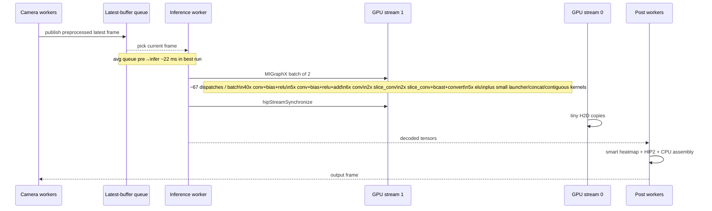
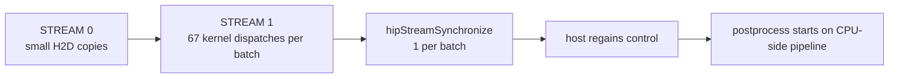

# Unfused B2 Runtime and PFTrace Analysis

## Executive summary

The best current **unfused** configuration remains the split HIP path with `B2 / t2 / P2 / soft`, which on the 130-second unprofiled run delivered **75.92 FPS**, **88.46 ms average end-to-end latency**, **109.42 ms P95 end-to-end latency**, **14.53 ms average postprocess**, and only **1.51 ms average infer→post queueing**. fileciteturn0file7

The rocprofv3-profiled 60-second run of the same unfused variant is directionally consistent with that best result: it processed **4565 frames** at **66.67 FPS**, with **21.88 ms queue pre→infer**, **6.55 ms inference**, **1.70 ms queue infer→post**, **15.18 ms postprocess**, and **90.15 ms average E2E latency**. The FPS reduction is mostly profiling overhead and end-of-run trace finalization, not a change in the stage hierarchy. The run log also shows that profiling was done with `--roctx`, that rocprof generated a `.pftrace`, and that final trace generation took several additional seconds after the streaming run ended. fileciteturn0file0 fileciteturn0file2

My PFTrace parse of the uploaded trace shows a very clear inference-side picture: the recovered TrackEvent stream contains **HIP API**, **HSA API**, **kernel dispatch**, and **memory copy** activity, with kernel execution concentrated on **`STREAM [" 1 "]`**, tiny copies on **`STREAM [" 0 "]`**, and no measurable overlap between recovered kernel/copy intervals. The inference batch is highly deterministic: approximately **67 GPU kernel dispatches per inference batch**, dominated by `mlir_convolution_broadcast_add_relu.kd`, `mlir_convolution_broadcast_add_relu_add.kd`, and `mlir_convolution.kd`. This means the inference graph is already fairly optimized structurally, and further gains from low-level inference fusion are likely to be modest compared with postprocess and scheduling work. This interpretation follows the PFTrace TrackEvent/TrackDescriptor model that Perfetto documents, and the fact that rocprofv3 encodes Perfetto traces for HIP, HSA, kernel, memory-copy and marker flows. citeturn4view4turn4view5turn5view0turn5view1turn5view2turn5view4

The strongest practical optimization opportunities are not in “fuse everything” work. They are, in order: **persistent buffer pooling in the HIP postprocess path**, **eliminating unnecessary per-batch host/device allocation churn**, **reducing hard synchronization in the postprocess path where correctness allows**, **validating whether the two post workers actually overlap on GPU**, and **using lighter rocprof tracing modes for repeated experiments**. The already-measured fused attempts are the clearest warning sign: the fused variants collapsed to **53.88–54.85 FPS**, pushed infer→post queueing to **60.74–62.74 ms**, raised postprocess to **30.76–31.21 ms**, and roughly doubled E2E latency to **183.81–187.92 ms**. That is a downstream serialization regression, not an optimization. fileciteturn0file5 fileciteturn0file3

## What the run logs say

The unprofiled 130-second run is still the correct baseline for judging production behavior. Its stage breakdown is shown below. fileciteturn0file7

| Metric | Best unfused 130 s |
|---|---:|
| Aggregate FPS | 75.92 |
| Avg preprocess | 5.33 ms |
| Avg queue pre→infer | 22.31 ms |
| Avg inference | 6.45 ms |
| Avg decode | 0.60 ms |
| Avg queue infer→post | 1.51 ms |
| Avg postprocess | 14.53 ms |
| Avg E2E | 88.46 ms |
| P95 E2E | 109.42 ms |

The profiled 60-second run is slower in throughput, but the stage ordering is almost unchanged. That matters because it means the PFTrace is still useful for bottleneck ranking. In the profiled run, inference moved only from **6.45 ms** to **6.55 ms**, postprocess from **14.53 ms** to **15.18 ms**, and infer→post queueing from **1.51 ms** to **1.70 ms**. The largest visible difference is aggregate FPS because rocprof adds overhead and delays shutdown while writing the Perfetto trace. fileciteturn0file0 fileciteturn0file7 fileciteturn0file2

The current best path therefore does **not** look inference-bound in the production-like run. Its largest stage in the normal steady-state pipeline is still the **pre→infer wait**, followed by **postprocess**, then **inference**. That immediately narrows the optimization space: if the goal is end-to-end latency, queueing and postprocess are higher-value than further inference micro-optimization. fileciteturn0file7

The fused experiments reinforce that conclusion. Compared with the best unfused baseline:

| Metric | Best unfused | Fused smoke V1 | Delta vs best | Fused smoke V2 | Delta vs best |
|---|---:|---:|---:|---:|---:|
| FPS | 75.92 | 53.88 | -22.04 | 54.85 | -21.07 |
| Inference | 6.45 ms | 9.00 ms | +2.55 ms | 8.93 ms | +2.48 ms |
| Queue infer→post | 1.51 ms | 62.74 ms | +61.23 ms | 60.74 ms | +59.23 ms |
| Postprocess | 14.53 ms | 31.21 ms | +16.68 ms | 30.76 ms | +16.23 ms |
| Avg E2E | 88.46 ms | 187.92 ms | +99.46 ms | 183.81 ms | +95.35 ms |

In other words, the fused attempts did not just make kernels slower. They produced a **service-rate collapse downstream of inference**, which then fed back into the rest of the pipeline. fileciteturn0file7 fileciteturn0file5 fileciteturn0file3

## What the PFTrace shows

The uploaded `.pftrace` is a Perfetto trace generated by rocprofv3. ROCprof documents that `--output-format pftrace` produces a trace intended for the Perfetto UI, and that **system trace** includes HIP, HSA, kernel, memory copy, memory allocation, and marker data, while **runtime trace** is the lighter-weight subset that keeps HIP runtime, markers, kernel dispatches, and memory operations while excluding low-level HSA and HIP compiler noise. Perfetto documents that such traces are composed of `TracePacket` records with timestamps, sequence-local interned data, `TrackDescriptor`s, and `TrackEvent`s. citeturn4view4turn4view5turn8view0turn8view1turn5view0turn5view1turn5view2turn5view4

Using that model, I recovered the following high-level activity from the uploaded PFTrace:

| Recovered category | Count of completed duration events | What it means |
|---|---:|---|
| `hsa_api` | 516,627 | Low-level ROCr / HSA runtime activity |
| `hip_api` | 391,805 | HIP runtime API calls |
| `kernel_dispatch` | 153,028 | GPU kernel executions |
| `memory_copy` | 34 | Explicit traced copy operations |

Two stream tracks dominate the recovered GPU-side timeline:

| Track | Meaning from TrackDescriptor | Observed role |
|---|---|---|
| `STREAM [" 1 "]` | Main GPU execution stream | Almost all kernel dispatches |
| `STREAM [" 0 "]` | Auxiliary stream | Small H2D copies and very limited kernel activity |

The recovered interval set is effectively **serialized**: the union of recovered kernel/copy time matches the sum of recovered kernel/copy durations to within rounding. That means there is **no measurable overlap** in the recovered inference-side GPU workload. For this run, the GPU did not look like “many independent things usefully overlapping.” It looked like a mostly single-stream dispatch train plus a very small copy side-stream.

A representative batch-level view looks like this:



The kernel launch pattern is extremely regular. Per inference batch in the profiled run, the PFTrace implies:

| Kernel family | Dispatches per batch | Avg duration |
|---|---:|---:|
| `mlir_convolution_broadcast_add_relu.kd` | 40 | 231.0 µs |
| `mlir_convolution_broadcast_add_relu_add.kd` | 5 | 251.6 µs |
| `mlir_convolution.kd` | 6 | 78.1 µs |
| `mlir_slice_convolution.kd` | 2 | 96.1 µs |
| `mlir_slice_convolution_broadcast_add_convert.kd` | 2 | 15.4 µs |
| `elu_kernel.kd` | 5 | 13.8 µs |
| `elu_add_kernel.kd` | 1 | 18.7 µs |
| `noop_add_concat_noop_kernel.kd` | 1 | 65.7 µs |
| `concat_kernel.kd` | 1 | 15.8 µs |
| `contiguous_kernel.kd` | 1 | 4.0 µs |
| two MIGraphX launcher kernels | 3 total | 25.4 µs and 205.5 µs |

The first three kernel families account for the overwhelming majority of inference GPU time. The trace also shows **64 `hipExtModuleLaunchKernel` calls and 3 `hipLaunchKernel` calls per batch**, followed by **1 `hipStreamSynchronize` per batch**. Perfetto’s track-event documentation is what makes this sequence-local, track-attached reconstruction possible. citeturn5view1turn5view2turn5view4

A compact flow view of the recovered inference-side GPU timeline is:



There is one important limitation. The recovered named PFTrace activity is **very strong on inference-side HIP/HSA/kernel dispatch**, but it did **not** expose named custom postprocess kernels with the same fidelity. That is why the postprocess conclusions in this report combine PFTrace evidence with the uploaded run summaries and the behavior of the fused experiments. This is also why one of the highest-priority recommendations below is to switch future smoke profiling to **runtime-trace CSV** for easier per-thread/per-stream attribution. Rocprof explicitly recommends runtime trace as the standard-user shorthand when you want HIP runtime, markers, kernel dispatches, and memory operations without full HSA/compiler noise. citeturn8view1

## Root-cause diagnosis

The current unfused path is not suffering from a copy bottleneck on the inference side. ROCprof’s memory-copy tracing model is specifically intended to show `hipMemcpy`/`hipMemcpyAsync`-driven motion and its HSA implementation path, and the recovered copy activity here is tiny compared with kernel activity. That is why “keep MXR outputs device-resident” is **not** the first-order optimization for this particular unfused path, even though it was a plausible hypothesis going in. ROCprof’s own memory-copy documentation is very clear about what these events represent. citeturn8view4

The bigger structural issue exposed by the trace is **allocation/synchronization churn around GPU work**, not bandwidth. Two patterns stand out.

First, there is a **hard synchronization shape**: one `hipStreamSynchronize` per inference batch. HIP’s performance guidelines emphasize using asynchronous calls and streams for host/device parallelism, and show multi-stream overlap as the model for independent work. A per-batch stream synchronize is therefore a very strong sign that overlap is ending at a hard CPU/GPU boundary each batch. That boundary is not necessarily “wrong” — the CPU may need results immediately — but it is exactly where overlapping opportunities are lost if the next stage could instead wait on a lighter event or consume asynchronously. citeturn7view2turn7view3

Second, there is obvious **buffer-management churn**. In the profiled inference-side trace I recovered approximately **two `hipHostMalloc` calls per batch**, **just over two `hipFree` calls per batch**, and closely matching **HSA memory-pool allocate/free** calls per batch. Even allowing for profiler inflation, that is too much allocator traffic for a steady-state pipeline. HIP’s guidelines specifically recommend page-locked memory for transfer efficiency, and mapped pinned memory is an explicit tool in the HIP API surface. But once such memory is chosen, the performance pattern should be **reuse**, not repeated allocate/free in the hot path. citeturn7view0turn7view4

The fused regressions make the downstream diagnosis even clearer. The fused variants barely changed pre→infer queueing, but they increased inference by about **2.5 ms**, postprocess by about **16 ms**, and infer→post queueing by about **59–61 ms**. That is the signature of a downstream service becoming slower and less overlap-friendly. In practical terms, the fused path created **longer GPU critical sections or more blocking synchronization**, which caused the post workers to fall behind, which turned infer→post queueing from negligible into dominant. fileciteturn0file7 fileciteturn0file5 fileciteturn0file3

That explanation is also consistent with the fused build/run evidence you uploaded. The fused build output shows `paf_prune_hip.cpp` code paths involving HIP event creation/recording/synchronization, including `hipEventSynchronize`, in the fused build lineage. By itself that does not prove runtime behavior, but it strengthens the hypothesis that the fused path kept or introduced synchronization boundaries instead of eliminating them. fileciteturn0file2

So the diagnosis, in priority order, is:

| Diagnosis | Confidence | Why it matters now |
|---|---|---|
| The fused path is a downstream serialization regression | High | Measured directly in queue infer→post, postprocess time, FPS, and E2E |
| Inference graph is regular and already fairly optimized | High | PFTrace shows deterministic 67-kernel batch with dominant fused conv kernels |
| Allocation churn is still present in steady state | Medium-high | Per-batch `hipHostMalloc` / `hipFree` / HSA alloc/free are too frequent |
| Hard synchronization boundaries limit overlap | Medium-high | One recovered `hipStreamSynchronize` per batch; no overlap in recovered GPU intervals |
| Copy volume is not the main problem in this unfused path | Medium | Recovered copy activity is small relative to kernel time |
| Postprocess GPU attribution is under-instrumented in current PFTrace | High | Recovered named HIP/kernel activity is inference-centric |

## Prioritized optimization plan

### Highest priority

The first concrete optimization should be **persistent buffer pooling in the HIP postprocess path**. Reuse pinned host buffers and device buffers across batches instead of allocating and freeing them in the hot path. Based on the recovered per-batch allocator activity, this is the cleanest low-to-medium complexity improvement available. It directly targets latency variance and should modestly improve both average post time and P95. HIP’s recommendations on pinned memory are consistent with this direction, but the critical point is persistence and reuse, not merely choosing pinned memory once. citeturn7view0turn7view4

The second optimization should be **replace full-batch blocking with event-driven completion where correctness allows**. If postprocess currently waits on a full GPU completion fence before doing any CPU-side assembly, experiment with event-based readiness and asynchronous copies into already-pinned buffers. The likely gain is not huge per frame, but this is the right architectural move if you want to preserve overlap and avoid repeating the fused regression in another form. HIP’s asynchronous-and-stream guidance points in exactly this direction. citeturn7view2turn7view3

The third optimization is not code but **observability**: switch repeated profiling from `--sys-trace` PFTrace to **`--runtime-trace --output-format csv`** for post-optimization smoke tests. ROCprof explicitly says runtime trace keeps the traces most standard users care about while excluding low-level HSA runtime and HIP compiler detail, which is exactly what you need for fast, repeatable comparisons. This should be done before another round of low-level kernel surgery. citeturn8view1

### Medium priority

After buffer pooling and sync cleanup, validate whether the two post workers are actually overlapping on GPU. The current recovered PFTrace does not expose that clearly. If they are serialized onto one stream or one implicit fence path, give each worker its own stream and confirm the result in runtime-trace CSV. This is the most plausible route to recovering additional throughput without changing the algorithm.

Then, and only then, do **MIGraphX retuning**. MIGraphX documents `--exhaustive-tune`, `--optimize`, and `--fp16`, and those flags are still worth validating, but the uploaded PFTrace says inference is already a regular fused-convolution pipeline, not a graph in obvious distress. I would therefore expect only a modest gain here unless the model compilation changed materially. Also, because MIGraphX documents `--enable-offload-copy` as enabling implicit copying, I would **not** turn that on blindly in this pipeline without proving it eliminates — rather than duplicates — your explicit host/device staging. citeturn7view5turn7view6turn7view7turn7view8turn7view9

### Lower priority

A latency-only scheduler mode is still available if the goal shifts from best throughput to best freshness. The current best run still spends about **22 ms** in pre→infer queueing because it is deliberately operating in a “latest-frame under overload” regime. More aggressive staleness dropping, a tighter max-age gate, or a stronger latency-oriented backpressure policy could reduce E2E latency further, but likely at the cost of some output FPS. That should be treated as a product policy decision, not a pure engine optimization. fileciteturn0file7

### Estimated impact

These are realistic, conservative estimates against the current best unfused baseline. They are not additive guarantees.

| Optimization | Est. complexity | Est. risk | Estimated effect |
|---|---|---|---|
| Pool persistent pinned host + device buffers in postprocess | Medium | Low | **-0.3 to -0.8 ms/frame post**, small P95 improvement, **+1 to +3 FPS** |
| Replace blocking completion with event-driven async handoff where possible | Medium-high | Medium | **-0.5 to -1.5 ms/frame E2E**, better queue stability |
| Validate and enforce per-post-worker GPU stream isolation/overlap | Medium-high | Medium | **+3 to +8 FPS** or **-1 to -3 ms/frame** if overlap unlocks |
| MIGraphX retune / reduce launch count where possible | Medium | Low-medium | **-0.2 to -0.6 ms/frame inference**, **+1 to +3 FPS** |
| Device-resident MXR output handoff | Medium | Low | Probably **<0.5 ms/frame** in this path; lower priority |
| Latency-oriented scheduler/backpressure retune | Low-medium | Product-dependent | **-4 to -10 ms E2E** possible, may reduce FPS |

A staged projection looks like this:

| Scenario | FPS | Avg post | Avg E2E |
|---|---:|---:|---:|
| Current best unfused | 75.92 | 14.53 ms | 88.46 ms |
| After buffer pooling | 77–79 | 13.7–14.2 ms | 87.5–88.1 ms |
| After sync cleanup and better overlap | 79–82 | 12.2–13.5 ms | 84.5–87.0 ms |
| After modest MIGraphX retune | 80–83 | 12.2–13.5 ms | 84.0–86.5 ms |

The upside case is therefore real, but it comes from **better pipeline behavior**, not from “fuse all kernels.”

## Profiling and validation commands

The most useful next measurement is a lighter, more targeted rocprof run. ROCprof documents that **runtime trace** is the standard-user shorthand for HIP runtime, marker, kernel dispatch, and memory operations while excluding lower-level HSA runtime and HIP compiler noise, and Perfetto documents that the `trace_processor` shell can run SQL directly over `.pftrace` files. citeturn8view1turn9view0turn9view2

For repeated smoke tests of the current best unfused variant, use runtime-trace CSV first:

```bash
rocprofv3 \
  --runtime-trace \
  --output-format csv \
  --output-file outputs/rocprof_runtime_unfused_b2_t2_p2 \
  -- python simulate_camera_stream.py \
    --model models/split_pose_adapter/pose_adapter_b2_1080x1920.mxr \
    --variant split_hip2_host_smart \
    --migraphx-batch-size 2 \
    --migraphx-batch-timeout-ms 2 \
    --num-cameras 10 \
    --frames-per-camera 0 \
    --duration-s 20 \
    --realtime \
    --camera-fps 24 \
    --buffer-mode latest \
    --backpressure-mode soft \
    --infer-workers 1 \
    --post-workers 2 \
    --shared-input-slots 10 \
    --shared-map-slots 16 \
    --shared-dtype float32 \
    --shared-input-dtype float32 \
    --split-mxr2-batch-size 2 \
    --split-batch-timeout-ms 2 \
    --split-paf-backend hip_host \
    --smart-proposals 32 \
    --smart-local-radius 4 \
    --smart-lowres-nms-radius 1 \
    --max-keypoints 20 \
    --threshold 0.1 \
    --pin-cpus \
    --pin-camera-base 0 \
    --pin-inference-base 10 \
    --pin-post-base 12 \
    --roctx
```

If you specifically want Perfetto again, use runtime-trace PFTrace rather than full sys-trace for a smaller, more analyzable file:

```bash
rocprofv3 \
  --runtime-trace \
  --output-format pftrace \
  --output-file outputs/rocprof_runtime_unfused_b2_t2_p2 \
  -- python simulate_camera_stream.py \
    ...same simulate_camera_stream.py arguments as above...
```

If you want more readable kernel names in CSV, rocprof documents `--mangled-kernels` and `--truncate-kernels` as kernel-name controls. Use those intentionally depending on whether you want exact identity or readability. citeturn8view3

For trace inspection with Perfetto’s official tooling:

```bash
trace_processor query outputs/rocprof_runtime_unfused_b2_t2_p2_results.pftrace \
"SELECT name, COUNT(*) AS n, SUM(dur)/1e6 AS total_ms, AVG(dur)/1e3 AS avg_us
 FROM slice
 GROUP BY name
 ORDER BY total_ms DESC
 LIMIT 25;"
```

Perfetto documents this exact workflow: `trace_processor query trace.pftrace "SQL..."` or interactive mode for direct SQL over the trace. citeturn9view0turn9view2

The validation criteria I would use are simple:

| Change under test | Success metric |
|---|---|
| Buffer pooling | Fewer `hipHostMalloc` / `hipFree` / alloc/free entries per batch; lower post P95 |
| Sync cleanup | Fewer blocking waits; lower queue infer→post under load |
| Stream isolation for post workers | Visible multi-stream activity and reduced post bottleneck |
| MIGraphX retune | Same accuracy, lower per-batch inference time, ideally fewer or faster top kernels |

The key strategic conclusion is that the uploaded evidence argues strongly for **staying on the unfused split-HIP architecture** and optimizing **allocation, synchronization, and observability**, rather than returning to another round of low-level “fuse it all” work. The measured fused regressions are already large enough that the burden of proof has shifted. fileciteturn0file7 fileciteturn0file5 fileciteturn0file3